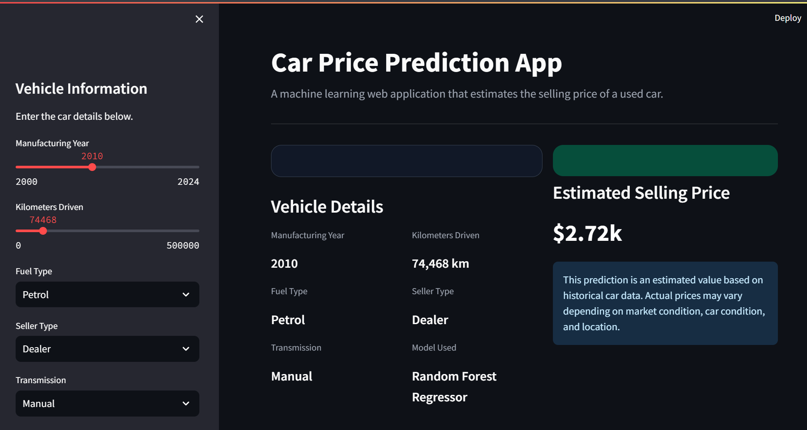

# Car Price Prediction App

A machine learning web application for predicting used car selling prices using Random Forest Regression and Streamlit.

---

## Application Screenshot



---

## Introduction

This project aims to predict the selling price of used cars using machine learning techniques. Accurate price prediction can help both sellers and buyers make informed decisions based on historical vehicle data.

---

## Dataset

The dataset used in this project is based on the Car Price Prediction dataset from Kaggle.

Features included:

* Manufacturing Year
* Selling Price
* Present Price
* Kilometers Driven
* Fuel Type
* Seller Type
* Transmission
* Number of Owners

Dataset source:

https://www.kaggle.com/code/mohaiminul101/car-price-prediction/notebook

---

## Data Preprocessing

* Confirmed that the dataset contains no missing values.
* Applied one-hot encoding to categorical variables.
* Standardized numerical features using StandardScaler.
* Removed unnecessary columns to improve prediction performance.

---

## Machine Learning Model

The project uses a Random Forest Regressor implemented with Scikit-Learn.

### Model Performance

| Metric                   | Value |
| ------------------------ | ----- |
| Mean Squared Error (MSE) | 4.10  |
| R² Score                 | 0.82  |

The Random Forest model achieved better performance than Linear Regression.

---

## Features

* Interactive Streamlit web application
* Real-time price prediction
* Adjustable vehicle parameters
* Random Forest Regression model
* Modern user interface

---

## Technologies Used

### Programming Language

* Python

### Libraries

* Pandas
* NumPy
* Scikit-Learn
* Streamlit
* Pickle

### Development Tools

* VS Code
* Jupyter Notebook

---

## Project Structure

```text
car-price-prediction/
│
├── README.md
├── app_screenshot.png
├── car data.csv
├── car_price_prediction.ipynb
├── car_price_prediction_app.py
├── random_forest_model.pkl
├── scaler.pkl
└── requirements.txt
```

---

## Running the Application

Install the required packages:

```bash
pip install -r requirements.txt
```

Launch the Streamlit application:

```bash
streamlit run car_price_prediction_app.py
```

Open the application in your browser:

```text
http://localhost:8501
```

---

## Future Improvements

* Include car brand and model information
* Experiment with additional machine learning models
* Improve prediction accuracy using larger datasets
* Deploy the application online
* Add data visualization dashboards

---

## Author

**Chaw Chit Su**

Diploma in Applied Artificial Intelligence
Temasek Polytechnic, Singapore

### Skills

* Python
* Machine Learning
* Scikit-Learn
* Streamlit
* Pandas
* Feature Engineering
* Data Preprocessing
* Random Forest Regression

---

## License

This project is created for educational and portfolio purposes.

